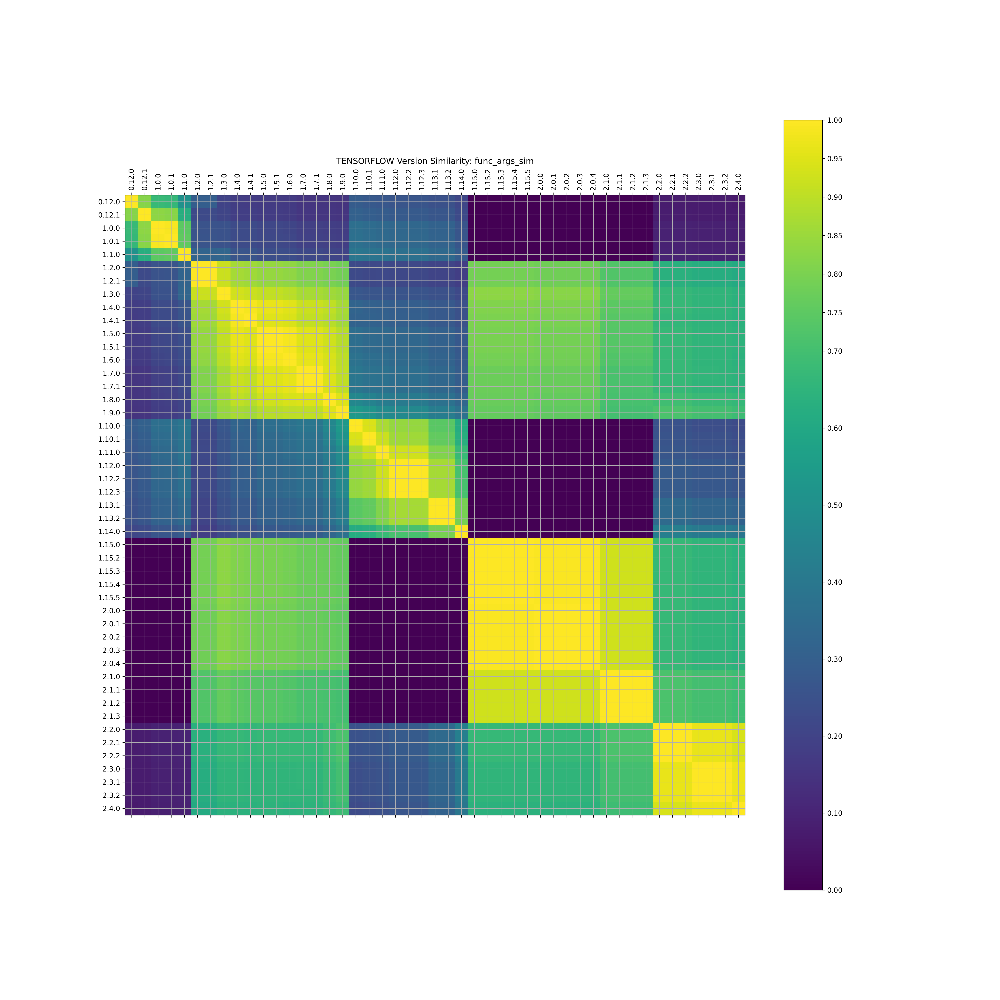

# Caliper TensorFlow

In this analysis, we want to start with baseline examples derived for specific
versions of Tensorflow (e.g., 0.11 vs v1 and v2) and then iteratively change
the versions until we either 1) cannot build the container anymore, or 2)
can build the container, but cannot run it, or 3) can build and run it,
but produce a different result.

All examples are derived from [aymericdamien/TensorFlow-Examples](https://github.com/aymericdamien/TensorFlow-Examples)
and [this branch](https://github.com/aymericdamien/TensorFlow-Examples/tree/0.11) under an MIT LICENSE.

## Examples

 - [tensorflow_v1](tensorflow_v1)
 - [tensorflow_v11](tensorflow_v0.11)
 - **tensorflow_v2** needs conversion from notebook to scripts!

For each of the above, to ensure some reproducibility and headless-ness across runs I modified the file to:

 - set a seed for each of numpy and tensorflow
 - remove matplotlib plots and print out model information instead
 - for some long running models, decreasing training epochs, increase batch size, or similar
 - removed any GPU usage, replacing with CPU (I don't have GPU)

## Usage

### 1. Generate Data

Caliper is currently intended for Python packages, as we are going to use a PypiManager.
You can first create a virtual environment just for doing the analysis (the analysis
itself will be done within containers built on the fly).

```bash
python -m venv env
source env/bin/activate
pip install -r requirements.txt
```

You then want to run the analysis with [1.run_analysis.py](run_analysis.py) and target
the [caliper.yaml](caliper.yaml) file that includes the libraries to use for the
install grid and functions to test.

```python
python 1.run_analysis.py --config caliper.yaml
```

This is going to save output to a hidden `.caliper` directory (also in this present
working directory) that will have a folder "data" with a json dump of tensorflow versions matched to dockerfiles
that can build them, and then test results (output, error, and return code) for each.
To learn more about the format of the `caliper.yaml` you should see the [caliper](https://github.com/vsoch/caliper)
repository.


### 2. Assess Change

We need different methods to be able to assess the differences between one tensorflow / python
version combination and another. We can create a simple list that increases in detail:

1. **set similarity**: we can basically derive a metric based on the set overlap of the dependencies (requirements.txt in the results)
2. **version similarity**: we can assume that semvar is being used, and changes in version number (minor vs major) are meaningful, and derive a similarity metric from that. For this we also don't need anything beyond the requirements.txt in the results.
3. **version changes**: more meaningful is to look at actual changes between versions. For this we will compare the function signatures between them.

For points 1 and 2, we have the information that we need in the results files to calculate this. For point 3, we
can use function signatures [loaded from a repository](https://caliper-python.readthedocs.io/en/latest/getting_started/user-guide.html#extraction-from-repository),
[caliper-metrics](https://github.com/vsoch/caliper-metrics) where (before running our analysis script here) we have run this command to generate a function lookup for each version of tensorflow:

```bash
$ caliper extract --metric functiondb pypi:tensorflow
```

And this is added to the repository to be read by Caliper. We can then run the
script:

```bash
python 2.assess_change.py
```

This will save two json structures of changes, the first for the function database, and
the second for the requirements (modules and versions) changes. Both are saved to
the [.caliper/sims](.caliper/sims) folder. We will want to plot these scores next,
and compare the matrices. We can then next plot the similarities.

```bash
$ python 3.plot_sims.py --filename .caliper/sims/pypi-tensorflow-sims.json
$ python 3.plot_sims.py --name requirements --filename .caliper/sims/pypi-tensorflow-requirements-sims.json --dim 35
```

Note that to make the plot simpler, we don't show the release candidates (as we assume they are
similar to the release). This will generate similarity matrix plots in the [.caliper/plots](.caliper/plots)
folder in both png and svg. Here is an example - showing the similarity metric to compare different versions
of tensorflow based on the function names *and* args (the most detailed comarison):



We can also look at similarity based on requirements, either considering versions:


Or just modules:


*Todo** We should also look at how different the plots are.

You can [browse the plots folder](.caliper/plots/) to see more detail, and for other 
plots to compare just functions (or one level up), modules.


### 3. Parse Data

**not done yet**

To develop functions to create combined files for visualization, there is an example
[parse_analysis.py](parse_analysis.py) script example provided.
